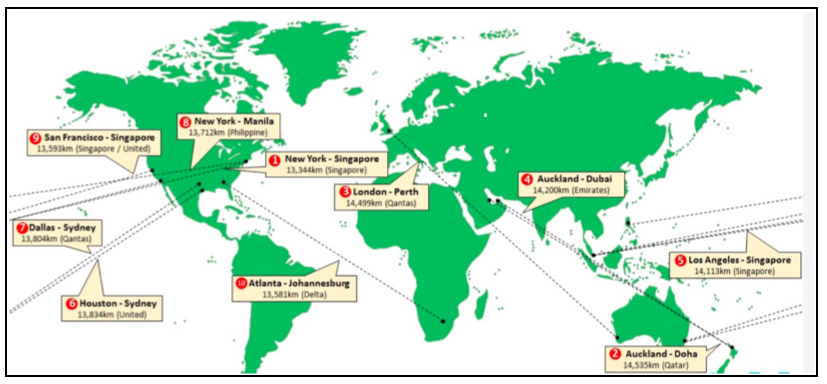

#Problem Statement: Route Planner

In this challenge, you will tackle a problem that many companies encounter on a daily basis. How is optimal route planning done ?

 

In the picture above, the air routes connecting different cities are shown. Here, the map displays only the distance in km. It does not display information on the flight timings and the cost of the ticket. It is possible to capture this information in a pre-agreed format by providing additional details. For example, source, destination, distance in km, flight time, ticket cost, etc.
    
For instance, the information on Delhi-Mumbai flight could be represented as:
-	Delhi, Mumbai, 1148, 2:10, INR6000

To capture this data in Java, consider a single dimensional array of strings in which each element of the array represents one such route. For example, the strings for the Delhi-Mumbai route and the London-San Francisco route will be: 

-	“Delhi, Mumbai, 1148, 2:10, INR6000”
-	“London, San Francisco, 8620, 11:05, GBP345” 

**In this multi-part programming challenge, you are required to do the following:**

Tasks:
1.	Write a program to:
- Read the flight route information as input from a CSV file named routes.csv. 
- Store the route information for each route in an array called routes[]. 
- Display the details of the flight route information that is read from the file as below,

````
From		To		Distance in km	    Travel Time		Typical Airfare
Delhi		Mumbai		1148			2:10		INR 6000
Delhi		London		6704			8:55		INR 37000
Delhi		Frankfurt	6117			8:35		INR 32000
Frankfurt	London		660	    		1:25		EUR 155
.......
.......
Los Angeles	Tokyo		8773			11:15		USD 520
````

2. 	Use the following function definition to help users plan trips using the information.
		**void showDirectFlights(String[] routeInfo,String fromCity)**

Write a function to respond to the following user query.
	- Use the name of a city (source city) and present a list of the other cities to which it has direct flights. If you do not have any information about the city mentioned by the user, give an appropriate message as below:
    “We are sorry. At this point of time, we do not have any information on flights originating from Amsterdam.”

For example, if the user has specified “Delhi”, then the output shown will be:

````
From		To		Distance in Km	Travel Time		Typical Airfare
Delhi		Mumbai		1148			2:10		INR 6000
Delhi		London		6704			8:55		INR 37000
Delhi		Frankfurt		6117			8:35		INR 32000
........
........
````

3.	If you look closely at the output produced by the function in **showDirectFlights()**, you will notice that the destination cities do not appear in a particular order. Perhaps, that was the sequence in which the user entered the data and, hence, it was stored in the routes[] array.

Write a function **sortDirectFlights(String directFlights[])** so that it lists the destination cities in an alphabetical order. 

For the earlier example, the output should be:
````
From		To		Distance in Km	Travel Time		Typical Airfare
Delhi		Frankfurt	6117			8:35		INR 32000
Delhi		London		6704			8:55		INR 37000
Delhi		Mumbai		1148			2:10		INR 6000
........
........
````

4.	Given the name of a source city and a destination city, analyze the available route information and confirm if the two cities are connected by air routes or not.

If the two cities are connected by air, show the corresponding route information. Note that there may be direct routes available as well as the routes that require connections through intermediate cities.

 - First, list the direct routes.
 - Next, list the routes that have intermediate connections.
 - If there are no flights connecting the two cities, display an appropriate message

For example, if the user wishes to travel from Delhi to London, the result based on the actual data may be:
````
From		To		Distance in km	Travel Time		Typical Airfare
Delhi		London		6704			8:55		INR 37000

Delhi		Frankfurt	6117			8:35		INR 32000
Frankfurt	London		660		        1:25		EUR 155

Delhi		Mumbai		1148			2:10		INR 6000 
Mumbai	    London		7187			9:30		INR 28000
	
````
Another example of travel from London-Sydney could be:
````

From		To		Distance in km	   Travel Time		Typical Airfare
London	 	Sydney			6704			8:55			GBP 600

London     	San Francisco	8620        11:05       	GBP 345
San Francisco   Sydney      11935       14:35       	USD 450
````
Use the following function definition:
**void showAllConnections(String[] routeInfo, String fromCity, String toCity)**

***Hint: Use recursive functions for the above task to find intermediate routes between the source and destination cities.***
